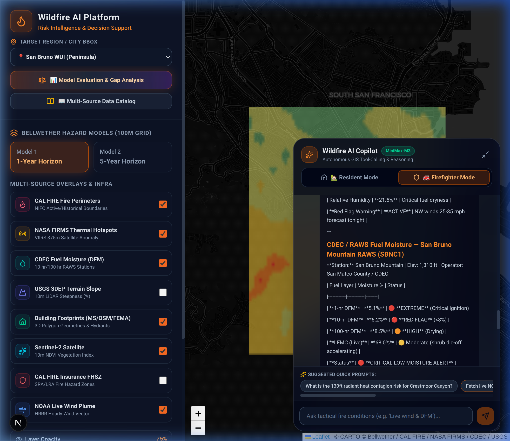
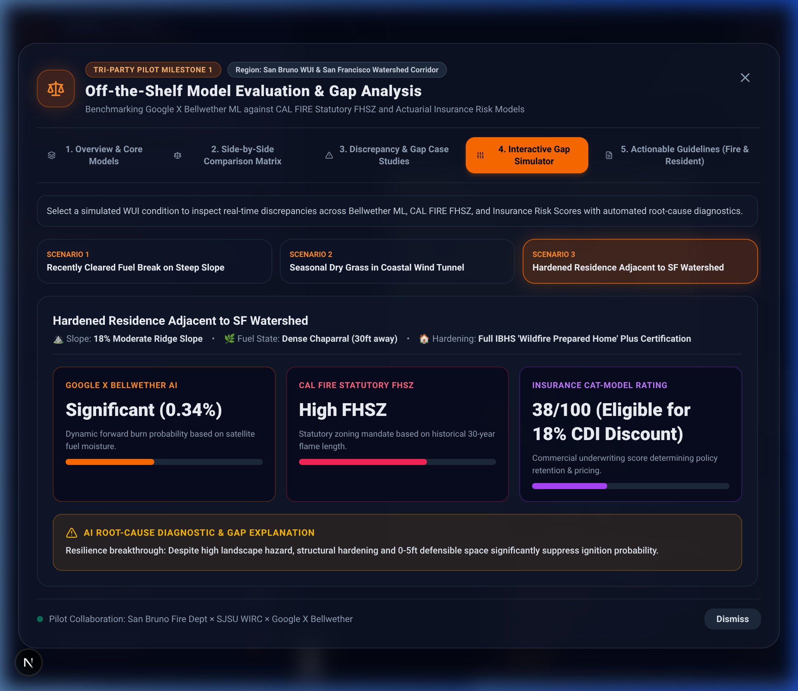
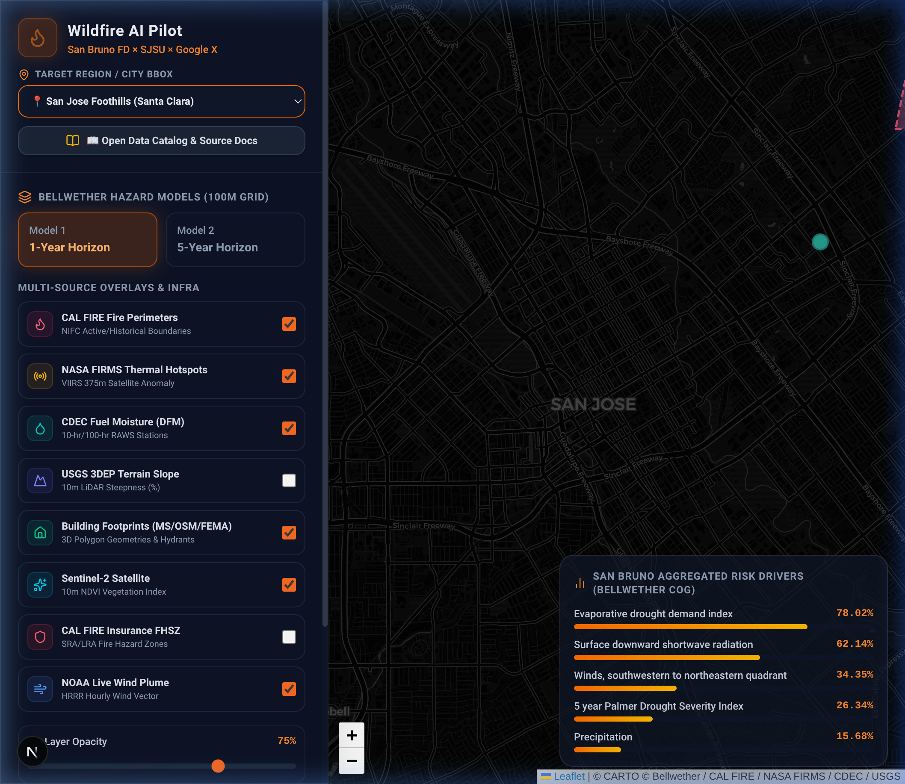
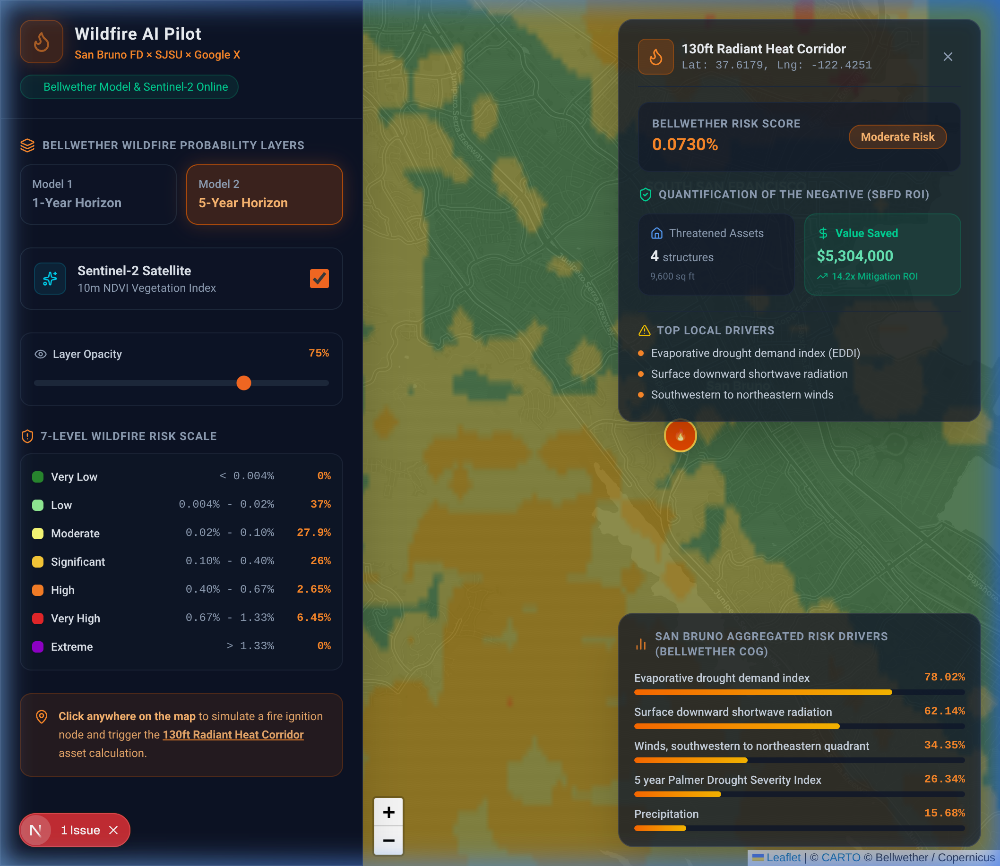

# Wildfire AI: Geospatial Intelligence & Multi-Model Decision Support Platform

[](http://localhost:3000)
[](http://localhost:8000)
[](https://leafletjs.com/)
[](https://www.python.org/)
[](#4-openai-compatible-multi-provider-architecture)
[](docs/ACADEMIC_WILDFIRE_MODELS_BENCHMARK.md)

An interactive, multi-source geospatial intelligence and wildfire decision-support platform. Engineered for wildland-urban interface (WUI) risk analytics, dynamic hazard raster rendering, physical & discrete fire propagation modeling, insurance discount compliance, and incident commander resource prioritization.

---

## 🌟 Platform Mission & User Value Propositions

This platform is engineered from the ground up to serve two critical stakeholder groups in high-risk wildfire corridors:

```
                          ┌──────────────────────────────────────────────┐
                          │   Wildfire AI Spatial Intelligence Engine    │
                          └──────────────────────┬───────────────────────┘
                                                 │
                 ┌───────────────────────────────┴───────────────────────────────┐
                 ▼                                                               ▼
   🏡 For Residents & Homeowners                                    🚒 For Incident Commanders & Firefighters
   • Demystify insurance non-renewals & FAIR plan rate spikes       • Real-time NOAA HRRR wind plumes & gust vectors
   • Prioritized Zone 0 (0-5ft) & Zone 1 home hardening             • Live CDEC/RAWS 1-hr, 10-hr, 100-hr fuel moisture (DFM)
   • Qualify for California CDI "Safer from Wildfires" discounts    • 130ft radiant heat contagion corridor simulation
   • Red Flag situational awareness & evacuation readiness           • "Quantifying the Negative" structural ROI valuation
```

### 🏡 For Residents & Property Owners
*   **Demystifying Wildfire Insurance**: Explains why actuarial catastrophe models (Verisk / Zesty.ai) cause policy cancellations, and how to appeal non-renewals.
*   **Home Hardening Action Plan**: Detailed instructions on retrofitting Class A roofing, 1/16-inch ember-resistant mesh vents, and double-pane tempered glass.
*   **Defensible Space Zone Compliance**: Visual guides for Zone 0 (0–5ft non-combustible gravel/paver buffer), Zone 1 (5–30ft lean/clean/green zone), and Zone 2 (30–100ft reduced fuel zone).
*   **Legally Mandated Premium Discounts**: Direct guidance to qualify for California Department of Insurance (CDI) "Safer from Wildfires" regulations (10 CCR § 2644.9) and IBHS Wildfire Prepared Home designations.

### 🚒 For Firefighters, Incident Commanders, & City Planners
*   **Live Environmental Telemetry**: Real-time integration of NOAA HRRR wind speed and direction vectors, CDEC fuel moisture monitoring stations, and NASA FIRMS VIIRS satellite thermal hotspots.
*   **130ft Radiant Heat Contagion Corridors**: Wind-adjusted structural contagion modeling based on Eric Saylors' fire propagation framework, calculating threatened asset values vs saved property values.
*   **Quantification of the Negative (S-Ratio)**: Quantitative justification of fire mitigation investments, calculating structural asset loss prevention for municipal leadership and city councils.
*   **Regulatory vs Dynamic Hazard Discrepancy Alerts**: Highlights tactical under-warning zones where modern dynamic AI burn probabilities exceed static CAL FIRE Moderate designations.

---

## 📸 Core Features & Visual Interface

### 1. Autonomous AI Wildfire Copilot (ReAct GIS Agent)

The platform features an embedded AI Copilot equipped with autonomous tool-calling capabilities. Powered by a generic OpenAI-compatible backend, the Copilot dynamically queries live GIS datasets, calculates corridor risk, checks fuel moisture thresholds, and provides tailored intelligence for residents and incident commanders.



*   **Dual Persona Architecture**: Switch seamlessly between **🏡 Resident Mode** (insurance discounts, home hardening steps) and **🚒 Firefighter Mode** (tactical fuel moisture, radiant heat corridors, S-Ratio calculations).
*   **Autonomous ReAct Tool-Calling**: The Copilot automatically triggers 6 specialized geospatial tools (`get_live_weather`, `get_live_fuel_moisture`, `query_corridor_risk`, `get_model_evaluation`, `get_home_hardening_guidelines`, `get_active_hotspots`).
*   **Dynamic Model Discovery**: Automatically discovers and displays the active model name and endpoint status.

---

### 2. Off-the-Shelf Model Evaluation & Gap Analysis

A dedicated educational and diagnostic panel allowing users to compare leading wildfire risk models side-by-side:



*   **5-Dimensional Comparative Tabs**:
    1. **Overview & Educational Guide**: Plain-language explanations of model differences, resolution, and update frequencies.
    2. **Comparative Matrix**: High-density feature comparison across Bellwether, CAL FIRE FHSZ, Commercial Cat-Models, and Academic SOTA.
    3. **Key Gap Analysis**: Detailed investigation into why static regulatory maps under-predict wind-driven fire spread in micro-corridors.
    4. **Actionable Recommendations**: Clear separation of operational guidelines for Fire Marshals vs Homeowners.
    5. **Academic SOTA & LLM Requirements**: Theoretical formulations (Level-Set PDEs, FNO, Cellular Automata) and data requirements for LLM spatial reasoning.

---

### 3. Multi-Source GIS Dashboard & Dynamic Regional Cropping

The interactive GIS map combines multiple satellite, topographic, and municipal layers with instant bounding-box spatial cropping:



*   **Multi-Region Support**: Instant 1-click camera re-centering and dynamic raster clipping across **San Bruno WUI**, **San Jose Foothills / Alum Rock**, and **Santa Cruz Mountains (CZU Fire Interface)**.
*   **Google Cloud Storage (GCS) Dynamic Rasters**: Downloads and crops Cloud-Optimized GeoTIFFs (COGs) on-the-fly for any selected bounding box.
*   **Live Layer Stack**:
    *   Google X Project Bellwether 100m Hazard Rasters (1-Year & 5-Year horizon)
    *   CAL FIRE Active Incidents & Historical Fire Perimeters
    *   NASA FIRMS VIIRS/MODIS Satellite Thermal Hotspots
    *   CDEC & RAWS Automated Weather / Fuel Moisture Stations
    *   USGS 3DEP LiDAR High-Resolution Topographic Elevation & Slope Aspect
    *   Microsoft Building Footprints (WUI Structural Density)

---

### 4. Wind-Adjusted 130ft Radiant Heat Contagion Corridor

Implements Eric Saylors' radiant heat propagation formula ($q''_{\text{incident}} = \epsilon \sigma F_{12} T_{\text{flame}}^4$), dynamically adjusting the 130-foot threshold based on live NOAA wind plumes:



*   **Directional Flame Elongation**: Elliptical corridor stretching along the downwind vector with lateral flanking buffer.
*   **Automated Parcel Spatial Intersect**: Calculates total threatened residential and commercial parcels within seconds.
*   **Negative Value Quantification**: Computes structural replacement valuation ($485/sqft baseline) and estimates the Saylors Mitigation ROI Ratio (S-Ratio).

---

## ⚙️ 4. OpenAI-Compatible Multi-Provider Architecture

The AI module (`backend/ai/`) utilizes a clean, decoupled OpenAI-compatible architecture. **Any OpenAI-compatible API endpoint can be tested and hot-swapped** without restarting the application:

```
                       ┌─────────────────────────────────────────┐
                       │     AIConfig (backend/ai/config.py)     │
                       └────────────────────┬────────────────────┘
                                            │
        ┌───────────────────┬───────────────┴───────────┬───────────────────┐
        ▼                   ▼                           ▼                   ▼
   Local Ollama         MiniMax API                 OpenAI API          DeepSeek / vLLM
(localhost:11434)   (api.minimaxi.com/v1)       (api.openai.com/v1)   (api.deepseek.com/v1)
 qwen2.5vl / gpt-oss     MiniMax-M3                    gpt-4o             deepseek-chat
```

### Switching Models in `backend/ai/provider_config.json`
Simply modify `backend/ai/provider_config.json` to select your preferred provider or specify a custom endpoint:

```json
{
  "active_provider": "minimax",
  "model": null,
  "base_url": null,
  "description": "Presets: 'minimax', 'ollama', 'openai', 'deepseek', 'vllm'. Or specify custom base_url & model."
}
```

### Dynamic Hot-Swapping via REST API
You can also hot-swap providers programmatically at runtime:

```bash
# Switch to Local Ollama running Qwen2.5-VL
curl -X POST http://localhost:8000/api/ai/switch-provider \
     -H "Content-Type: application/json" \
     -d '{"provider": "ollama", "model": "qwen2.5vl:7b-q8_0"}'

# Switch back to MiniMax API
curl -X POST http://localhost:8000/api/ai/switch-provider \
     -H "Content-Type: application/json" \
     -d '{"provider": "minimax"}'
```

*API keys are automatically discovered from environment variables or `~/.bashrc` (`MINIMAX_API_KEY`, `OPENAI_API_KEY`, `DEEPSEEK_API_KEY`).*

---

## 🔬 5. Academic Frontier Wildfire Prediction Models

In addition to commercial and regulatory models, the platform includes **local, runnable implementations of frontier academic wildfire propagation models** under [`src/academic_models/`](file:///Developer/wildfire_ai/src/academic_models/):

1.  **Rothermel Level-Set PDE Solver** ([`rothermel_level_set.py`](file:///Developer/wildfire_ai/src/academic_models/rothermel_level_set.py)):
    *   Solves the continuous Hamilton-Jacobi PDE $\partial \phi / \partial t + R(\mathbf{x}, \nabla \phi) \|\nabla \phi\| = 0$ using a first-order Godunov upwind scheme.
    *   Strict energy and mass conservation with zero front leakage across non-burnable fuel breaks.
    *   Execution Latency: **46.9 ms** on CPU.
2.  **Alexandridis Stochastic Cellular Automata** ([`cellular_automata.py`](file:///Developer/wildfire_ai/src/academic_models/cellular_automata.py)):
    *   Discrete 8-neighbor probabilistic automata with wind vectoring and slope aspect multipliers.
    *   Native stochastic **Weibull firebrand ember spotting jump operator**, modeling long-range ignition ahead of the front.
    *   Execution Latency: **104.7 ms** on CPU.
3.  **Standardized Academic Benchmark Suite** ([`benchmark_suite.py`](file:///Developer/wildfire_ai/src/academic_models/benchmark_suite.py)):
    *   Evaluates models against Google Research NDWS (NeurIPS 2021) and WildfireSpreadTS (NeurIPS 2023) protocols.
    *   Measures Critical Success Index (CSI / Threat Score), Intersection-over-Union (IoU), Sørensen-Dice, and execution latency.

> 📘 **Dedicated Technical Report**: For formal mathematical derivations, PDE finite-difference discretization, and comprehensive benchmark experiments, see **[`docs/ACADEMIC_WILDFIRE_MODELS_BENCHMARK.md`](file:///Developer/wildfire_ai/docs/ACADEMIC_WILDFIRE_MODELS_BENCHMARK.md)**.

### Academic REST API Endpoints
*   `GET /api/academic/models`: Metadata and governing equations of academic models.
*   `GET /api/academic/benchmark-results`: Executes standardized comparative benchmark evaluation.
*   `POST /api/academic/simulate`: Interactive on-demand physical/discrete fire propagation simulation.

---

## 🚀 6. Quick Start Guide

### Prerequisites
*   Node.js 18+ & npm
*   Python 3.10+ (with PyTorch, NumPy, SciPy, FastAPI, GDAL/Rasterio)

### 1. Launch FastAPI Backend (Port 8000)
```bash
# In repository root:
python3 -m uvicorn backend.main:app --host 0.0.0.0 --port 8000 --reload
```
*   API Documentation: [http://localhost:8000/docs](http://localhost:8000/docs)
*   Health Check: [http://localhost:8000/api/health](http://localhost:8000/api/health)

### 2. Launch Next.js Frontend (Port 3000)
```bash
cd frontend
npm run dev -- -p 3000
```
*   Web Dashboard: [http://localhost:3000](http://localhost:3000)

### 3. Run Academic Benchmark Verification
```bash
python3 -c "from src.academic_models import AcademicBenchmarkRunner; import json; print(json.dumps(AcademicBenchmarkRunner.run_comprehensive_benchmark(), indent=2))"
```

---

## 📚 7. Project Documentation Index

*   📘 **[Academic Wildfire Models Benchmark (docs/ACADEMIC_WILDFIRE_MODELS_BENCHMARK.md)](docs/ACADEMIC_WILDFIRE_MODELS_BENCHMARK.md)**: Deep dive into physical Level-Set PDEs, Cellular Automata, Google NDWS benchmark, and research roadmaps.
*   📓 **[Wildfire Ground-Truth & Benchmark Tutorial (docs/WILDFIRE_GROUND_TRUTH_DATA_TUTORIAL.md)](docs/WILDFIRE_GROUND_TRUTH_DATA_TUTORIAL.md)**: Guide to ground-truth label datasets in `/data/wildfire_benchmark_data/` (WFIGS, CAL FIRE DINS, USGS MTBS, NASA FIRMS, WildfireSpreadTS).
*   📕 **[Interdisciplinary Survey Report (docs/WILDFIRE_AI_SURVEY_REPORT.md)](docs/WILDFIRE_AI_SURVEY_REPORT.md)**: Comprehensive survey on CS/AI interdisciplinary research, causal inference, and WUI computer vision.
*   📗 **[Technical Data Pipeline & GIS Specifications (src/README.md)](src/README.md)**: In-depth technical specifications for all 10 integrated geospatial datasets, mathematical formulas, and student research projects.
*   📙 **[System Architecture & Walkthrough (src/walkthrough.md)](src/walkthrough.md)**: Step-by-step engineering walkthrough of the multi-source GIS ingestion pipeline.

---

## 📄 License
Released for open academic research and municipal fire safety innovation.
