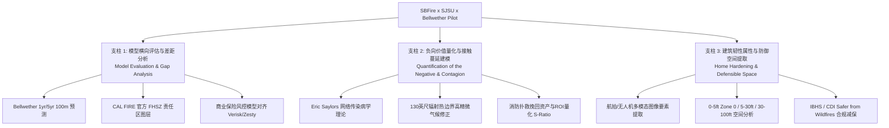
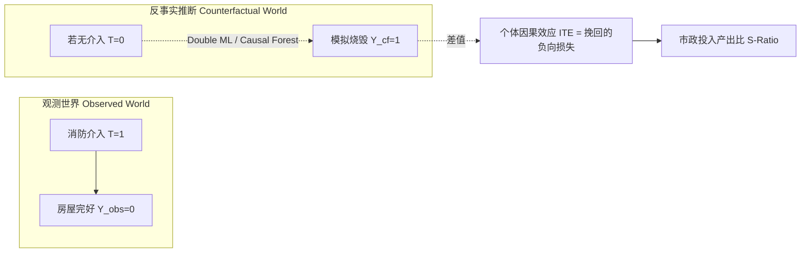
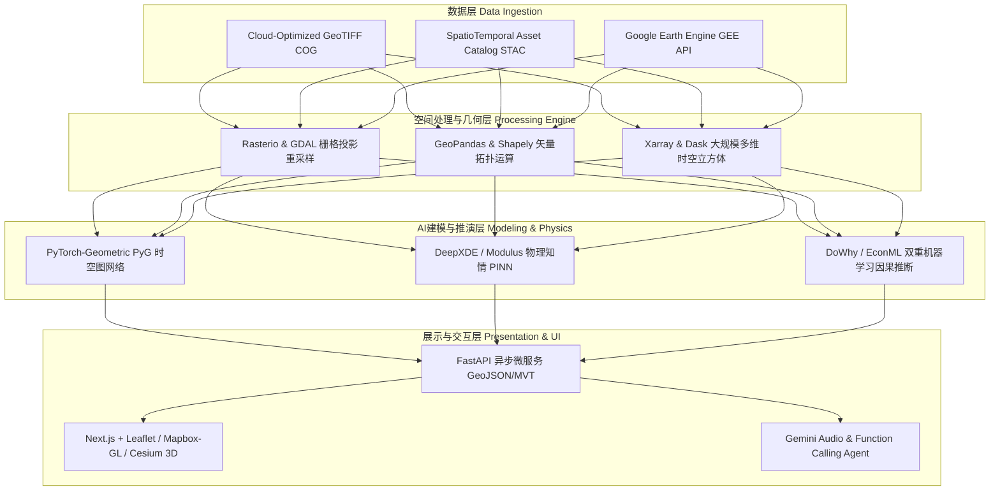

# 野火风险减缓与计算野火科学：学术文献、工业项目与跨学科研究综合调研报告
## Wildfire Risk Mitigation & Computational Wildfire Science: Comprehensive Literature, Systems Survey & Interdisciplinary Research Roadmap

> **项目依托背景**：基于《SBFire_SJSU Project Scoping Summary: Wildfire Risk Mitigation Pilot》（圣布鲁诺消防局 San Bruno Fire Department、圣何塞州立大学 SJSU WIRC/计算机工程系、Google X Project Bellwether 三方合作初步需求）  
> **面向对象**：计算机科学（CS）、人工智能（AI）、数据科学及智能硬件背景的研究人员、高校导师与硕博研究生  
> **报告撰写日期**：2026年9月  

---

## 目录 (Table of Contents)
1. [执行摘要与项目初步需求深度解构](#1-执行摘要与项目初步需求深度解构)
2. [学术研究领域前沿调研 (Academic Research Survey: 还能做什么？)](#2-学术研究领域前沿调研-academic-research-survey)
   - 2.1 野火蔓延与动态行为建模：从物理模型到物理知情AI (PINN/Neural Operators)
   - 2.2 建筑间级联蔓延与热辐射动力学 (Contagion Modeling & Radiant Heat Physics)
   - 2.3 建筑抗火硬化与多模态遥感/无人机计算机视觉 (Home Hardening & Defensible Space CV)
   - 2.4 反事实因果推断与“负向价值量化” (Causal Inference & "Quantification of the Negative")
   - 2.5 领域公开基准数据集与评估指标体系 (Benchmark Datasets & Evaluation Metrics)
3. [实际应用与工业工程领域前沿调研 (Practical & Industrial Survey: 还能做什么？)](#3-实际应用与工业工程领域前沿调研-practical--industrial-survey)
   - 3.1 消防与应急指挥决策支持系统 (Operational Wildfire Decision Support Systems)
   - 3.2 财产保险风险评估与州政府监管合规 (Insurance Cat-Modeling & Regulatory Compliance)
   - 3.3 社区级火灾预防与韧性城市规划 (Community Resilience & Evacuation Routing)
   - 3.4 生成式大模型、多模态智能体与语音调度 Copilot (Generative AI & Agentic Copilots)
4. [核心差距分析与重大技术机遇 (Gap Analysis & Research Opportunities)](#4-核心差距分析与重大技术机遇-gap-analysis)
5. [计算机背景研究者的跨学科研究方法论指南 (CS Researcher's Interdisciplinary Playbook)](#5-计算机背景研究者的跨学科研究方法论指南-cs-researchers-playbook)
   - 5.1 思维范式转变与常见“大坑” (Paradigm Shifts & Common Pitfalls)
   - 5.2 计算机学者必备的野火科学核心领域知识 (Wildfire Domain Crash Course)
   - 5.3 跨学科时空地理计算技术栈 (Geospatial & Data Engineering Toolchain)
   - 5.4 面向学生的子课题规划与论文选题矩阵 (Student Thesis & Capstone Roadmap)
   - 5.5 顶级发表渠道、国家基金与产学研合作途径 (Publication Venues, Grants & Collaborations)

---

## 1. 执行摘要与项目初步需求深度解构

### 1.1 三方合作背景与核心诉求
本调研报告的原始输入为《Project Scoping Summary: Wildfire Risk Mitigation Pilot》，该试点项目由三个关键实体构成：
*   **San Bruno Fire Department (SBFD)**：由 Chief Michael Ku 和 Marshal Jessica Power 领导，提供地面一线实战经验、高风险责任区（LRA）边界、检查数据与实地验证基准；
*   **Google X - Project Bellwether**：由 Martha Wedner 和 Josh Jeffery 领导，提供基于海量多模态遥感与气象大数据训练的下一代机器学习野火概率预测模型（100米空间分辨率、季度更新的 1 年与 5 年绝对概率 GeoTIFF/COG 栅格及底层风险因子）；
*   **San Jose State University (SJSU)**：由 Wildfire Interdisciplinary Research Center (WIRC) 与计算机工程系（Julie Willey、Prof. Kaikai Liu、Prof. Louis Freund 等）协同，依托 Tower Foundation 组织 CS/AI/CompE 硕博研究生开展数据融合、算法攻关与工程原型落地。

### 1.2 项目定义的三大核心支柱 (Core Pillars)


1.  **现成模型评估与差距分析 (Off-the-Shelf Model Evaluation & Gap Analysis)**：
    *   将 Google X Bellwether 0–100% 细粒度火灾概率模型与圣布鲁诺地方责任区（LRA）野生动物-城市交界域（WUI）的真实火灾风险图（CAL FIRE FHSZ）叠加对比，找出传统静态物理/行政区划图层与前沿 AI 预测之间的空间不一致性与盲区；
    *   分析不同模型与商业保险精算模型（如 Verisk FireLine、Zesty.ai）的差异，解释造成加州居民保费暴涨、拒保和退保的深层次数据分歧。
2.  **落实“负向价值量化” (Operationalizing "Quantification of the Negative")**：
    *   传统应急响应只统计“烧毁了多少栋房屋、损失了多少美元”（正面损失），无法有效衡量“**因为消防力量的及时介入或预防性减灾措施，成功保护了多少原本必被烧毁的资产**”（负向价值挽回）；
    *   基于前 Sacramento / El-Cerrito 消防局长 Eric Saylors（Naval Postgraduate School）提出的 **传染网络理论（Contagion Node Modeling）**，将着火建筑视作病毒感染源，沿圣布鲁诺与旧金山流域（San Francisco Watershed）接壤的高危 WUI 界面展开；
    *   利用 Bellwether 的高分辨率可燃物（Fuel）、微气象风场和卫星影像，修正传统静态保守的 **130英尺（约40米）热辐射接触传播半径**，精准测算潜在受威胁资产的重置价值（Replacement Cost），为市政防灾预算提供明确的投资回报率（ROI / S-Ratio）。
3.  **建筑硬化属性提取与防御空间验证 (Home Hardening and Property-Level Attributes)**：
    *   通过无人机（UAV）倾斜摄影、LiDAR 与高分卫星影像，自动化识别屋顶耐火等级（Class A 如沥青瓦、陶瓦、金属瓦 vs 易燃木摇瓦）、外墙材质（水泥灰泥 Stucco vs 木质墙板）、防余烬檐口细网格窗（1/16 至 1/8 英寸）；
    *   自动测量 0–5 英尺（Zone 0 无燃区）、5–30 英尺（Zone 1 稀疏区）、30–100 英尺（Zone 2 减燃区）的防御空间合规性，打通加州保险局（CDI）“Safer from Wildfires”法案与防灾安全协会（IBHS）“Wildfire Prepared Home”认证通道，赋能居民主动减免保费。

---

## 2. 学术研究领域前沿调研 (Academic Research Survey)

在计算机科学（CS/AI）与野火科学（Wildland Fire Science）交叉领域，近 3–5 年迎来了爆发式增长。对于 CS 背景学者，该领域绝非简单的“图像分割”或“时空预测”，而是充满复杂物理约束、高度时空非平稳性与极端长尾分布的学术蓝海。

### 2.1 野火蔓延与动态行为建模：从物理模型到物理知情AI (PINN/Neural Operators)

#### 现有范式与痛点
*   **传统物理/半经验数值模拟器**（如 Rothermel 表面火方程、FARSITE、FlamMap、Prometheus、FIRETEC、WFDS）：
    *   *优势*：具备坚实的燃烧热力学与流体力学基础，可解释性极高；
    *   *致命缺陷*：计算开销极其巨大（CFD 级别仿真难以做实时推演），且对极其细微的输入初值（微地形 DEM、冠层含水率、瞬时风矢量）高度敏感，极易产生误差累积。
*   **纯数据驱动深度学习模型**（如 ConvLSTM、PredRNN、U-Net、Swin-Transformer、PatchTST）：
    *   *优势*：推理速度在毫秒级，适合做超大规模蒙特卡洛情景推演；
    *   *致命缺陷*：属于“黑盒拟合”，完全忽略能量守恒、质量守恒与达西定律，在极端火灾天气（如 Diablo 风、Santa Ana 风导致的爆发性飞火）等分布外（OOD）场景下预测边界经常出现非物理的“穿墙”、“逆风突变”或“空降斑块”。

#### 前沿突破方向（CS 研究者可大有作为的学术点）
1.  **物理知情神经网络 (PINN) 求解火线水平集方程 (Level-Set & Eikonal PDEs)**：
    *   将火前锋面的扩展建模为水平集方程：
        $$\frac{\partial \phi}{\partial t} + R(\mathbf{x}, t, \nabla \phi) \|\nabla \phi\| = 0$$
        其中 $R(\mathbf{x}, t, \nabla \phi)$ 为受坡度、风速风向（Rothermel 公式）控制的蔓延速率（Rate of Spread, ROS）。
    *   在神经网络的损失函数中加入 PDE 残差项：$\mathcal{L} = \mathcal{L}_{\text{data}} + \lambda_{\text{PDE}} \mathcal{L}_{\text{PDE}} + \lambda_{\text{bc}} \mathcal{L}_{\text{boundary}}$。
    *   *学术创新点*：**Bayesian PINN (B-PINN)** 用于不确定性量化；针对突变风向的非光滑界面隐式追踪。
2.  **神经算子 (Neural Operators, FNO & DeepONet) 实现零样本跨分辨率代理模拟**：
    *   傅里叶神经算子 (Fourier Neural Operator, FNO) 在无限维函数空间学习从环境场（高程 DEM、燃料网格、时变风场）到火灾到达时间场（Time of Arrival, TOA）的映射。
    *   相比传统数值求解器加速 1,000 至 10,000 倍，并能在 100m 训练的模型上直接零样本推演 10m 分辨率，解决大规模防灾推演的算力瓶颈。
3.  **时空图神经网络 (Spatio-Temporal GNNs) 捕捉离散非欧几里得地形火行为**：
    *   将自然山脊、溪流、防火隔离带、道路网抽象为图节点与异质边，通过 Message Passing 捕捉由于烟囱效应（峡谷引风）导致的非局域蔓延跳变。

---

### 2.2 建筑间级联蔓延与热辐射动力学 (Contagion Modeling & Radiant Heat Physics)

初步需求中重点强调了 **Eric Saylors 的“传染病网络模型”** 与 **130英尺（约40米）辐射热半径**。在学术界，这是一个将网络科学（Network Science）、计算传热学与高分遥感深度交叉的前沿课题。

#### 物理机理与数理建模
```
       [着火建筑 Node A]
           │ 
           ├── (1) 热辐射通量 (Radiant Heat Flux) ──> [相邻建筑 Node B] (若 > 12.5 kW/m² 且在 130ft 内)
           │
           └── (2) 飞火余烬飘落 (Ember Spotting) ───> [远处建筑 Node C] (长尾随机游走跳跃 0.5~2 km)
```

1.  **斯特藩-玻尔兹曼热辐射方程与视角因子 (View Factor)**：
    *   建筑表面接收的热辐射通量为：
        $$q''_{\text{incident}} = \epsilon \sigma F_{12} T_{\text{flame}}^4$$
        其中 $\sigma = 5.67 \times 10^{-8} \, \text{W/(m}^2\cdot\text{K}^4)$，$\epsilon$ 为火焰发射率（通常取 0.85~0.95），$F_{12}$ 为着火建筑与目标建筑物之间的空间形态视角因子（View Factor），$T_{\text{flame}}$ 为火焰黑体温度（典型木质结构全面燃烧时约为 1000K~1300K）。
    *   根据 NFPA 80A / NFPA 1144，引燃未硬化木质外墙的临界热辐射通量门槛通常为 **$12.5 \, \text{kW/m}^2$**；超过该门槛且持续曝露数分钟，受热建筑将发生无火花自燃。
    *   **130英尺（约40米）经验值**正是基于最坏假定（双层大火、强顺风火焰倾角）下 $q''$ 衰减至临界安全阈值以下的理论几何距离。
2.  **超越静态 130ft：动态可变辐射与余烬跳跃图模型 (Dynamic Contagion Graph)**：
    *   *缺陷*：静态各向同性的 130ft 圆形缓冲区无法反映风速风向对火焰倾斜角（Flame Tilt Angle）的影响，也忽略了火灾蔓延的主要杀手——**飞火余烬（Firebrands / Embers）**；
    *   *学术改进点*：
        *   构建**有向加权时序图 (Dynamic Directed Graph)** $G=(V, E, W_t)$，其中节点 $V$ 为建筑微斑块，边权重 $W_{ij}(t) = P_{\text{radiation}}(i \to j \mid \theta_{\text{wind}}, d_{ij}) + P_{\text{ember}}(i \to j \mid \mathbf{v}_{\text{wind}}, \tau_{\text{lofting}})$；
        *   余烬传输采用对数正态（Log-Normal）或威布尔（Weibull）重尾飞行跳跃分布建模；
        *   应用流行病学 SIR / SEIR 模型（Susceptible 易感建筑 $\to$ Exposed 受热蓄热 $\to$ Infected 着火引燃 $\to$ Removed 烧毁或被扑灭），将消防员出枪灭火抽象为对重点网络节点的“**免疫接种（Dynamic Immunization）**”，计算网络连通性阻断临界相变点。

---

### 2.3 建筑抗火硬化与多模态遥感/无人机计算机视觉 (Home Hardening & Defensible Space CV)

圣布鲁诺试点明确指出：需要提取建筑构件属性（Class A 屋顶、灰泥墙面、防余烬通风口）并界定防御空间缓冲区。这是典型的计算机视觉（CV）与摄影测量问题。

#### 属性层级与视觉检测难度分解
| 空间层级 | 规范要求 (IBHS / CDI Safer from Wildfires) | 遥感/图像模态 | 核心视觉算法与技术挑战 |
| :--- | :--- | :--- | :--- |
| **Zone 0 (0–5 ft)** | 建筑根基5英尺内绝对非可燃区（无植被、无木护根覆土、无可燃栅栏连接） | 厘米级无人机正射影像 (Orthomosaic)、低空倾斜摄影、LiDAR 点云 | **极高挑战**：高遮挡细粒度分割；区分地面非可燃砾石、草皮与可燃木屑地膜；区分金属栅栏与相连木栅栏。 |
| **Zone 1 (5–30 ft)** | “精简、洁净、绿色”灌木修剪区，清除枯枝落叶，乔木冠层间距至少18英尺 | 高分卫星 (NAIP 0.6m, WorldView 0.3m)、无人机航拍 | **中等挑战**：冠层与底表树干/梯级可燃物（Ladder Fuels）的高度分层解耦（需多回波 LiDAR 或立体像对）。 |
| **Zone 2 (30–100 ft)** | 减燃稀疏区，草本植被定期除草至高度低于4英寸 | 公开卫星遥感（Sentinel-2, PlanetScope） | **低挑战**：NDVI / EVI 植被指数与归一化可燃物含水率指数（NDFMI）时序动态监测。 |
| **屋顶耐火等级** | Class A（不可燃：金属瓦、水泥平瓦、沥青复合瓦） vs Class C/未评级（可燃木摇瓦 Wood Shakes） | 卫星天顶影像、倾斜航拍、高光谱遥感 | **中等挑战**：细粒度纹理识别与材质反射率分类（Vision Transformer / Mask2Former）。 |
| **细部硬化构件** | 檐口/地基通风口网眼 $\le 1/8$ 英寸、双层钢化玻璃、封闭式屋檐底板（Soffits） | 街景全景图（Google StreetView）、地面手持拍照、无人机近距绕飞 | **高挑战**：小目标检测（YOLOv10/v11）、复杂反光几何、3D 场景重建（3D Gaussian Splatting）。 |

#### 前沿学术方向
1.  **基于 Segment Anything Model 2 (SAM 2) 与高分航拍的建筑物防御空间弱监督分割**：
    *   结合 OpenStreetMap / Microsoft Building Footprints 的建筑先验边界，利用 SAM 2 的零样本泛化能力快速提取 0–5ft 与 5–30ft 范围内的精细植被遮挡；
2.  **多视角立体几何与 3D 高斯泼溅 (3D Gaussian Splatting / NeRF) 建立 WUI 社区数字孪生**：
    *   通过无人机自主巡检视频流，实时重建建筑物立面三维几何，精确测量阳台下方离地高度、屋檐结构与临近可燃树木的欧式最短三维物理间距。

---

### 2.4 反事实因果推断与“负向价值量化” (Causal Inference & "Quantification of the Negative")

Eric Saylors 提出的“Quantifying the Negative”不仅是管理学命题，在机器学习领域本质上属于**因果推断（Causal Inference）中的反事实估计（Counterfactual Prediction）**。

#### 为什么传统统计学无法解决？
在真实的火灾数据集中，我们只能观测到两类事实结果：
1.  消防队未到达的偏远荒野：火灾烧毁了全部可燃资产；
2.  消防队布防扑救的成熟社区：火灾停止，大部分房屋安然无恙。

如果直接拿这两组数据训练监督分类模型，模型会得出荒谬的关联伪因果：“因为消防员去了某地，所以该地房屋受损更轻，或者因为某地着火严重才招致更多消防力量”（混杂偏倚 Confounding Bias 与选择性偏倚 Selection Bias）。

#### 潜在结果框架 (Rubin Causal Model) 与算法落地
对于每一栋处于火线威胁走廊内的建筑 $i$：
*   处理变量 $T_i \in \{0, 1\}$：是否实施了消防防护介入（如灭火水枪覆盖、湿润剂喷洒、砍伐隔离带）；
*   潜在结果 $Y_i(1)$：在消防介入下的烧毁状态（实际观测到 $Y_i(1)=0$，未烧毁）；
*   反事实结果 $Y_i(0)$：**如果没有消防介入，该建筑是否会被烧毁？**
*   **拯救资产价值 (Value Saved)** 表达为：
    $$\text{Total Saved} = \sum_{i \in \text{Assets}} \text{ReplacementCost}_i \cdot \mathbb{E}[Y_i(0) - Y_i(1) \mid X_i]$$
    其中 $X_i$ 包含该建筑的微气候风速、燃料含水率、距火前锋线距离及 130ft 范围内的相邻燃烧节点特征。



*   **前沿方法推荐**：
    *   **双重机器学习 (Double Machine Learning, DML)**：利用高维深度神经网络消除环境混杂因素（地形、植被、风速）的非线性偏倚，得到无偏的介入处理效应估计；
    *   **合成控制法 (Synthetic Controls) 与因果森林 (Causal Forests)**：在历史无扑救野火蔓延案例库中，为当前被保护的资产寻找微环境特征完全一致的“数字孪生对照组”，科学证明“若无消防行动，此处根据物理蔓延规律有 92.4% 概率在 17 分钟内完全炭化”。

---

### 2.5 领域公开基准数据集与评估指标体系 (Benchmark Datasets & Evaluation Metrics)

进行学术研究与论文写作必须依托权威公开 Benchmark，避免闭门造车：

#### 核心公开数据集梳理 (2021–2026)
1.  **Google Research - Next Day Wildfire Spread (NDWS)**：
    *   *特点*：包含全美多年历史火灾的大规模栅格数据集，集成高程、风速、气温、干旱指数、土地利用与植被类型，分辨率 1km，专门用于预测未来 24 小时火前锋线扩展。
2.  **WildfireSpreadTS (WSTS) & WSTS+ (NeurIPS)**：
    *   *特点*：专门针对多变量时间序列建模的火灾扩散基准数据集，提供逐日连续火灾足迹与对应的遥感多光谱波段，是测试时空模型（ST-Transformer）的 SOTA 标杆。
3.  **FireSentry (ACM SIGKDD 2026)**：
    *   *特点*：最新的多模态高分辨率野火预警基准，集成无人机红外/可见光连续视频、边缘气象传感器与复杂林业特征，面向细粒度空间推演。
4.  **xBD Dataset (CVPR)**：
    *   *特点*：Maxar 提供的高分辨率灾害受损建筑多边形多模态数据集（0.5米光学卫星），涵盖野火前后对比与四级受损真值标签（No Damage, Minor, Major, Destroyed），是建筑脆弱性评估的核心基准。
5.  **WildfireDB (AAAI / IEEE T-PAMI)**：
    *   *特点*：基于 VIIRS 卫星热异常点与 ERA5 再分析气象流构建的大规模时空火蔓延图谱。

#### 评估指标体系 (严禁仅使用 Accuracy)
*   **临界成功指数 (Critical Success Index, CSI / Threat Score)**：$\text{CSI} = \frac{TP}{TP + FP + FN}$（对极度不平衡的火灾正负样本具有鲁棒性）；
*   **空间容差交并比 (Spatially-Buffered IoU)**：允许火线预测在物理传感器误差（如 50m~100m 容差带内）获得柔性评分，避免传统像素级硬 IoU 对微小错位惩罚过重；
*   **概率校准指标 Brier Score 与 ECE (Expected Calibration Error)**：评估如 Bellwether 输出的“70% 火灾概率”是否在统计上真正意味着 100 次中有 70 次起火；
*   **推移边界推土机距离 (Earth Mover's Distance, EMD) / 瓦瑟斯坦距离**：衡量预测火线与真实火线几何形状的连续分布拟合度。

---

## 3. 实际应用与工业工程领域前沿调研 (Practical & Industrial Survey)

从工程与实用角度，野火技术正在从“事后救灾”全面转向“事前主动防御”与“事中精准闭环指挥”。以下是目前北美及全球应急管理、保险、公用事业领域最紧迫的落地需求与工程方案。

### 3.1 消防与应急指挥决策支持系统 (Operational Wildfire Decision Support Systems)

#### 行业代表系统与技术架构
```
[卫星/无人机/传感器数据] 
       │
       ├──> Technosylva (Wildfire Analyst) ──> 预测火线扩散与逃生路线
       ├──> UCSD WIFIRE (BurnPro3D) ───────> 计划烧除 (Prescribed Burns) 仿真
       └──> AlertCalifornia / Pano AI ─────> 360°双光谱相机自动烟雾识别报警
```
*   **Technosylva (Wildfire Analyst Enterprise)**：加州消防局（CAL FIRE）、南加州爱迪生电力（SCE）与圣地亚哥电力（SDG&E）的一线系统。核心功能是接收实时代际风暴预报，在几秒钟内推演 500 次火蔓延仿真，为电网拉闸限电（PSPS）与消防部队提前进驻提供依据；
*   **WIFIRE Lab / BurnPro3D (UC San Diego)**：由 NSF 资助，结合下一代超级计算机，专门针对“计划烧除”（Prescribed Fire）与生态减灾进行高分辨率动态燃料湿度与火蔓延耦合推演；
*   **AlertCalifornia / AlertWest + Pano AI**：部署在全美各山顶微波塔上的数千台 360 度超高清光学/热成像重力感应云台，结合边缘视觉模型，在烟雾升起 1–2 分钟内三角定位起火坐标。

#### 实用领域还能做什么？
1.  **极端微地形下的“超本地化”微气候降尺度 (Micro-Meteorology Downscaling)**：
    *   目前 NOAA HRRR 气象预报分辨率为 3km，无法解析沿海圣布鲁诺山隘口处的狭管海风（Fog & Marine Layer）对局部相对湿度的急剧抬升。
    *   *工程方案*：利用物联网 LoRaWAN 边缘微气象站网结合轻量级神经网络，将 3km 粗粒度风场降尺度至 50m，精准预测风向何时将火势推向居民区。
2.  **动态防灾撤离路径规划与瓶颈通行能力实时评估**：
    *   结合实时交通流（TomTom/Google Maps API）与动态预测的火线烟雾边界，自动规避单向双车道山路盲端，生成分阶段（Staged Evacuation）撤离引导指令。

---

### 3.2 财产保险风险评估与州政府监管合规 (Insurance Cat-Modeling & Regulatory Compliance)

#### 现实困境：加州保险危机
由于极端野火频发（如 2018 Camp Fire、2020 CZU Complex、2021 Dixie Fire、2025 Palisades Fire），State Farm、Allstate 等大型保险巨头大举削减加州业务，大量屋主被推向昂贵且保障有限的兜底加州 FAIR Plan。核心症结在于：**保险精算模型（以历史宏观损失为基准）与居民/社区实际投入的微观抗火改造严重脱节**。

#### 主流商业风控模型对比
*   **Verisk FireLine**：传统行业标准，依赖燃料类型、坡度以及与消防栓/消防站的道路进入距离（Access）三大主观打分指标；
*   **Zesty.ai (Z-FIRE)**：获得加州保险局批准的下一代 AI 灾害模型，利用卫星航拍分析单栋房屋周边的可燃树木遮蔽率与建筑特征；
*   **CoreLogic Wildfire Risk Score**：融合全美历史起火频率与地表坡向的巨灾暴露度模型。

#### 实用领域还能做什么？
1.  **加州法规“Safer from Wildfires”自动化审计报表生成器**：
    *   加州法律明确规定，若屋主满足以下 10 项减灾标准，保险公司必须依法给予保费折扣：
        *   *建筑层级*：Class A 屋顶、闭合屋檐、6英寸防燃底墙裙板、双层玻璃、多孔防火通风口；
        *   *空间层级*：0–5ft Zone 0 无可燃物、5–30ft 定期清理、可燃垃圾桶外移；
        *   *社区层级*：获得 Firewise USA 社区评级。
    *   *工程方案*：开发端到端手机/无人机巡检 SaaS，居民拍照上传后，自动化生成符合 CDI（加州保险局）标准的合规验证报告与减保申请书（PDF/JSON 凭据）。
2.  **从“静态扣分”到“动态减灾投资回报计算器 (Mitigation ROI Calculator)”**：
    *   系统为居民提供个性化建议：“若花费 $800 清理北侧 5 英尺内的灌木并更换通风口滤网，你的 Bellwether/Z-FIRE 风险分将从 82 降至 54，年保费可节约 $1,200，投资回收期仅需 8 个月”。

---

### 3.3 社区级火灾预防与韧性城市规划 (Community Resilience & Evacuation Routing)

1.  **公共林火隔离带 (Fuel Breaks) 的拓扑最优化布局**：
    *   结合运筹学与强化学习（RL），在给定市政绿化修剪预算约束下，在城市边缘选择最佳林相改造多边形，最大化降低整个圣布鲁诺主城区在 95 分位极端风况下的被动过火概率。
2.  **水网与消防栓供水极限压力水力学仿真**：
    *   在特大 WUI 火灾中，多处建筑同时喷淋或水带引水会导致管网水压失压（Water Pressure Drop）。将 GIS 管网数据与火灾扩散模型联合仿真，指导指挥官调度移动运水车。

---

### 3.4 生成式大模型、多模态智能体与语音调度 Copilot (Generative AI & Agentic Copilots)

大语言模型（LLM）与多模态智能体（Multimodal Agents）为传统笨重迟缓的 GIS 软件注入了革命性的交互体验。

```
              [指挥官自然语言语音输入]
              "查找 35 号公路沿线坡度大于 25 度、燃料含水率低于 10% 的所有未修剪居民点"
                         │
                         ▼
        ┌──────────────────────────────────┐
        │  Gemini Multimodal Agent (LLM)   │
        │  - Function Calling 意图识别     │
        │  - 参数提取 (经纬度, 阈值, 缓冲区)  │
        └──────────────────────────────────┘
                         │
         ┌───────────────┼──────────────┐
         ▼               ▼              ▼
   [PostGIS SQL]   [Bellwether COG] [RAWS API]
   (空间几何过滤)    (100m 风险栅格)   (实时遥测)
         │               │              │
         └───────────────┼──────────────┘
                         │
                         ▼
             [高亮渲染 GeoJSON 图层]
             + [结构化语音合成即时播报]
```

#### 实用领域还能做什么？
1.  **消防长官便携式多模态野火副驾 (Wildfire Command Copilot)**：
    *   利用 Whisper 或 Gemini 实时语音接口，消防车指挥员无需在晃动的车厢内点击多层复杂 GIS 菜单，直接通过无线电对讲机自然语言查询：“调出圣布鲁诺峡谷上风侧 500 米内所有木屋顶房屋与行动不便老人住址”。
    *   Agent 自动调用底层已封装的工具链（`fetch_bellwether_cog`、`query_osm_buildings`、`get_raws_fuel_moisture`、`get_firms_hotspots`），拼装空间 SQL 并驱动前端 Leaflet/Mapbox 自动缩放聚焦。
2.  **居民防灾科普与心理减压智能顾问 (Resident Fire-Safe Agent)**：
    *   居民上传一张自家后院杂物堆的照片，Agent 指出：“注意：木栅栏直接连接在木屋檐下（形成导火索），后院烤箱距可燃灌木仅 2 英尺，违反了 Zone 0 规定，建议立即移开”。

---

## 4. 核心差距分析与重大技术机遇 (Gap Analysis & Research Opportunities)

通过对比学术界文献与产业界实战痛点，可以提炼出当前制约行业发展的四大核心“代沟”，每一个代沟都是极具学术价值与商业前景的突破口：

| 核心维度 | 学术界现状 (State of the Art in Academia) | 工业/实战界现状 (Industry & Operational Practice) | 核心差距 (The Critical Gap) | 计算机学者的技术机遇 (AI/CS Opportunity) |
| :--- | :--- | :--- | :--- | :--- |
| **时空分辨率与延迟** | 关注 10m~30m 遥感推演，或几毫米 DNS 燃烧网格，通常离线跑几天 | 依赖 1km 气象预报与数小时延迟的卫星过轨，对秒级前线响应无能为力 | **“秒级火情 vs 天级遥感”的时延脱节** | 基于边缘设备端到端低延迟流式计算，融合无人机近景与卫星全局的 Super-Resolution 跨尺度重构。 |
| **空间尺度断层** | 野火模型大多将城市/居民区整体当作“不可燃水体/人造地表”Mask 掉 | 城市火灾模型只考虑单体室内燃烧，把周围野火简化为一个恒定温度场 | **“野地燃烧”与“建筑引燃”在 WUI 界面的割裂** | 研发跨尺度统一混合计算图（Forest-to-Structure Multiscale Physics-guided Model）。 |
| **模型可解释性与法律信任** | 习惯端到端黑盒 CNN/Transformer，追求测试集 AUC/F1 小数点后两位提升 | 消防队长与市政官僚对黑盒毫无信任度；保险费率上报需经 CDI 严格法定听证 | **“黑盒高精度”与“法定透明度”的不可调和** | 研发可微分规则引擎、事后可解释归因（SHAP/Integrated Gradients）、PINN 物理方程残差可视化。 |
| **干预措施与数据偏倚** | 训练数据集中将“火线在此处熄灭”归因于环境特征（如植被潮湿），忽略扑救记录 | 现场几百名消防员开掘隔离带、直升机洒水，火势被动终止而非自然熄灭 | **强混杂变量缺失带来的伪因果谬误** | 将历史调度运力（CAD 日志、推土机轨迹）显式编码进因果干预模型中，实现真正的负向价值量化。 |

---

## 5. 计算机背景研究者的跨学科研究方法论指南 (CS Researcher's Interdisciplinary Playbook)

对于计算机学院（CS/AI/CompE）的导师、研究生与工程师，涉足“AI + 减灾/野火”领域最大的障碍通常不是算法不够深，而是**缺乏对物理规律与领域工程痛点的敬畏，陷入算法自嗨**。本指南提供一套完整的方法论路线图。

### 5.1 思维范式转变与常见“大坑” (Paradigm Shifts & Common Pitfalls)

```
        ❌ 常见错误思维 (CS 盲区)                    ✅ 正确跨学科思维 (Domain-Aware CS)
┌──────────────────────────────────────┐       ┌──────────────────────────────────────┐
│ 把火灾蔓延当作纯视频超分辨率/插帧任务 │  ──>  │ 火蔓延受风速对流与可燃物含水率严格物理控制 │
│ 忽略空间自相关，随机打乱划分训练测试集 │  ──>  │ 必须按大流域/年份实施空间分块与时序阻断切分 │
│ 追求绝对 Accuracy，忽略 99.9% 负样本  │  ──>  │ 使用 CSI, IoU, 边界 Wasserstein 距离评估    │
│ 以为卫星图像能看到一切                │  ──>  │ 树冠层下遮挡了 80% 的地表枯枝落叶梯级可燃物 │
│ 认为模型上线就能解决问题              │  ──>  │ 一线消防员在浓烟断网高压下只需最简单的指令 │
└──────────────────────────────────────┘       └──────────────────────────────────────┘
```

1.  **切忌“空间数据穿越” (Spatial Data Leakage)**：
    *   *错误做法*：在整张加州卫星图上随机抽取 100x100 像素切片，按 8:2 随机划分 Train/Test。
    *   *后果*：由于地理空间强自相关性（Tobler's First Law of Geography），训练集的相邻像素直接泄露给测试集，论文测试集 F1 高达 0.98，一到实际应用彻底崩溃。
    *   *标准做法*：**空间块交叉验证 (Spatial Block Cross-Validation)** 或 **留一火场验证 (Leave-One-Fire-Out Cross-Validation)**，用北加州的火训练，在南加州或完全未见过的独立山头测试。
2.  **理解“极度类别不平衡” (Extreme Class Imbalance)**：
    *   在任意给定的 100km² 区域，真正起火燃烧的像元往往不足 0.01%。全预测为 0 的模型准确率高达 99.99%。
    *   必须使用 Focal Loss、Dice Loss、Tversky Loss，且核心评估基准必须锁定在 **CSI (Threat Score)**。
3.  **尊重消防战术真实逻辑**：
    *   绝不要设计让一线扑火人员在断网断电、穿戴重型厚手套的情况下在屏幕上做微小拖拽的复杂 UI；数据可视化必须是**高对比度、大字体、单手语音可控、离线优先（Offline-First）**。

---

### 5.2 计算机学者必备的野火科学核心领域知识 (Wildfire Domain Crash Course)

在开始写代码前，必须掌握以下专业术语并能用数学语言表达：
1.  **Scott & Burgan 40 种标准可燃物模型 (Standard Fire Behavior Fuel Models)**：
    *   美国林务局（USFS）与 LANDFIRE 将植被细分为草本（GR）、灌木（SH）、林下木（TU）、乔木枯枝落叶（TL）等 40 种分类。每种分类定义了不同的载荷量、表面积体积比与熄灭含水率。
2.  **死可燃物含水率 (Dead Fuel Moisture - DFM) 的时滞特性 (Timelag)**：
    *   *1 小时时滞燃料*（草本、细枝 $<1/4$ 英寸）：响应空气湿度波动极快，几十分钟内即可干燥引燃；
    *   *10 小时时滞燃料*（小树枝 $1/4 \sim 1$ 英寸）；
    *   *100 小时与 1000 小时时滞燃料*（大树干、粗倒木）：反映长期气候干旱，是产生极端大火的能量基座。
3.  **活可燃物含水率 (Live Fuel Moisture Content - LFMC)**：
    *   新鲜树叶细胞内的含水百分比。加州特有的灌木丛（Chaparral）在夏秋季 LFMC 跌破 60% 时，即进入随时可能爆发冠层火（Crown Fire）的临界点。
4.  **火线蔓延速率 (Rate of Spread, ROS) 与火焰长度 (Flame Length)**：
    *   根据 Byram 经验公式，火线强度 $I = H \cdot w \cdot R$（$H$ 为发热量，$w$ 为单位面积消耗燃料质量，$R$ 为 ROS），火焰长度与强度呈亚线性对数关系：$F_L = 0.0775 \cdot I^{0.46}$。

---

### 5.3 跨学科时空地理计算技术栈 (Geospatial & Data Engineering Toolchain)

计算机背景同学请建立规范的专业 GIS 与时空 AI 开发流水线，严禁使用手写 OpenCV 坐标硬算：



*   **地理坐标系与投影 (CRS)**：永远牢记 WGS84 (EPSG:4326, 经纬度角度) 与投影坐标系（如加州常用的 UTM Zone 10N EPSG:32610 或 California Albers EPSG:3310，单位米）的换算。在计算 130ft 几何缓冲区时，必须先将图层重投影到米制坐标系，绝不能在 EPSG:4326 上直接加减经纬度！
*   **云原生地理格式 (Cloud Native Geospatial)**：
    *   **COG (Cloud Optimized GeoTIFF)**：配合 HTTP Range Requests，无需下载整个几 GB 栅格文件即可毫秒级读取特定视窗内的像素切片；
    *   **STAC (SpatioTemporal Asset Catalog)**：标准化检索天基卫星（Sentinel-2, Landsat-9, NAIP）时空元数据。

---

### 5.4 面向学生的子课题规划与论文选题矩阵 (Student Thesis & Capstone Roadmap)

结合 SJSU 计算机工程系、人工智能硕士（MSAI）、软件工程硕士（MSCS）及计算机工程硕士（MSCompE）培养目标，可将本调研成果拆解为四个互为支撑的研究方向：

#### 子课题 A (MSAI / Thesis)：物理知情时空神经算子野火前锋面推演
*   **核心攻关**：针对 Bellwether 100m 粗粒度年化概率模型在短期（1~24小时）动态蔓延中的局限，设计 Physics-Guided Neural Operator (PINO) 或 Level-Set PINN；
*   **输入**：USGS 3DEP DEM、RAWS 逐小时微气象、LANDFIRE 燃料模型、历史火灾起火点；
*   **创新点**：将 Rothermel 蔓延公式嵌入 Loss 函数，实现比传统 FARSITE 快 1,000 倍的零样本外推；
*   **发表目标**：NeurIPS (Climate Change AI Track), AAAI (Special Track on AI for Social Impact), 或 IEEE T-GARSS。

#### 子课题 B (MSCS / Thesis)：基于网络传染病理论与双重机器学习的“负向价值量化”框架
*   **核心攻关**：将 Eric Saylors 局长提出的 130 英尺经验辐射热蔓延模型泛化为动态各向异性有向图；利用因果推断（Double Machine Learning）计算被保护建筑群的反事实烧毁概率；
*   **输入**：圣布鲁诺与旧金山流域交界处建筑轮廓、微气候风速向、SBFD 历史扑救出动记录；
*   **创新点**：首次用数理因果模型量化“如果消防员没来，这栋价值 $1.5M 的房屋有 88% 的概率被引燃”，计算真实的减灾回报率（S-Ratio）；
*   **发表目标**：ACM SIGKDD (Applied Data Science Track), ACM SIGSPATIAL, 或 International Journal of Wildland Fire。

#### 子课题 C (MSCompE / Hardware & UAV)：边缘多模态无人机自主巡检与 3D 防御空间审计
*   **核心攻关**：开发无人机机载实时计算系统（Jetson Orin Nano/NX），运行轻量级视觉模型；
*   **输入**：倾斜摄影可见光流、机载热成像、轻量固态 LiDAR；
*   **创新点**：实现对 0–5ft Zone 0 无燃区违规杂物、木质走廊以及屋顶材质（Class A vs 木摇瓦）的高精度 3D 语义分割与体积测量；
*   **发表目标**：IEEE IROS / ICRA (Agri & Forestry Robotics Track) 或 CVPR EarthVision Workshop。

#### 子课题 D (MSCS / Capstone)：多模态大模型野火指挥 Copilot 与全栈交互中枢
*   **核心攻关**：基于本项目现有的 FastAPI + Next.js 全栈代码，接入 Gemini 实时语音多模态流与 Function Calling 机制；
*   **功能**：实现一线消防长官与辖区居民双角色交互，动态调度后端数据抓取流水线（Bellwether COG, CAL FIRE, FIRMS, OSM, RAWS）；
*   **工程价值**：直接部署于圣布鲁诺消防局指挥平板，作为实际试点系统的展示门面与系统集成总成。

---

### 5.5 顶级发表渠道、国家基金与产学研合作途径

#### 顶级学术发表渠道 (Publication Venues)
1.  **计算机与人工智能顶级会议 (CS Conferences)**：
    *   **NeurIPS / ICML**：Climate Change AI (CCAI) Track, Datasets and Benchmarks Track；
    *   **AAAI**：AI for Social Impact (AISI) Track；
    *   **ACM SIGKDD**：Applied Data Science Track；
    *   **CVPR / ICCV**：EarthVision (Large Scale Computer Vision for Remote Sensing) Workshop；
    *   **ACM SIGSPATIAL**：国际地理信息空间系统学术会议。
2.  **地球科学、遥感与防灾顶级期刊 (Domain Journals)**：
    *   **RSE (Remote Sensing of Environment)** (IF > 11, 遥感顶级)；
    *   **IEEE T-GARSS (IEEE Transactions on Geoscience and Remote Sensing)**；
    *   **IJWF (International Journal of Wildland Fire)** (国际林火学会会刊，同行评议标准最高)；
    *   **Fire Safety Journal** (火灾科学与工程权威)；
    *   **Nature Communications / Science Advances** (跨学科重大社会影响力成果)。

#### 核心科研经费与基金资助渠道 (Grant Opportunities)
*   **美国国家科学基金会 (NSF)**：
    *   *NSF Smart & Connected Communities (S&CC)*：非常契合圣布鲁诺城市防灾数字化试点；
    *   *NSF Cyber-Physical Systems (CPS)*：契合无人机/物联网传感器与城市物理防灾系统；
    *   *NSF Wildfire Interdisciplinary Research Grants*；
*   **联邦与加州地方防灾基金**：
    *   *CAL FIRE Forest Health & Fire Prevention Grants* (每年数千万美元预算分配给加州高校与地方消防局)；
    *   *FEMA Assistance to Firefighters Grants (AFG) & Fire Prevention and Safety (FP&S)*；
*   **企业产学研创新奖 (Industry Awards)**：
    *   *Google Cloud Research Credits & Climate AI Awards*；
    *   *Microsoft AI for Earth*；
    *   *Amazon AWS Imagine Grant for Public Safety*。

---

## 6. 结语与项目行动倡议 (Concluding Remarks)

野火风险减缓是一项关乎人民生命财产安全、城市生态安全与极端气候适应性的崇高事业。加州面临的野火与保险危机，本质上是**极端天气频发、微观建筑防灾脆弱性与粗放式宏观风控决策**之间的脱节。

依托《SBFire_SJSU Project Scoping Summary》的三方技术框架：
1.  我们不仅要做好 **Google X Bellwether 100米先进 AI 模型的横向对齐与验证**；
2.  更要深入 **Eric Saylors 的网络传染病学物理内核**，以计算机因果推断为武器，真正破解“负向价值无法量化”的百年公共管理难题；
3.  同时以 **计算机视觉与智能物联网无人机技术** 下沉到 0–5 英尺建筑微观硬化指标，赋能居民与消防局。

本调研报告为本项目的算法攻关、系统工程迭代以及学生的学术论文选题提供了全局视角的蓝图。后续建议团队依托已构建的 Wildfire AI 全栈代码底座（`fastapi_backend` + `nextjs_frontend` + `src/data_fetchers`），持续推进各项子模块的深度突破！
